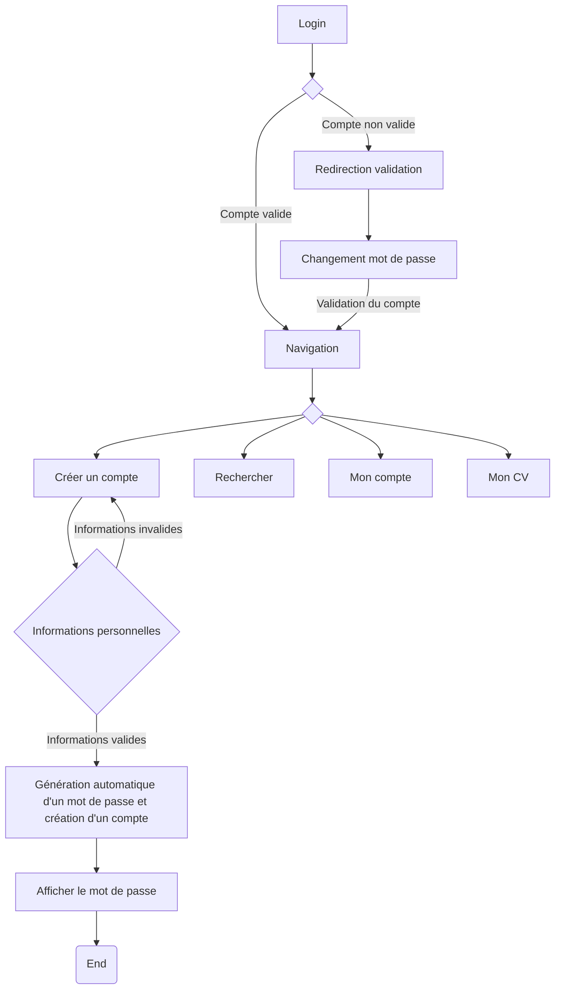

# AMUBook est un projet réalisé dans la cadre de L'UE "Architecture des applications" pour le Master II ILD sur le site de St-Jérôme

## Spécifications et exigences

L'application doit permettre:

- La création d'un compte utilisateur sur un modèle de cooptation.
- L'édition d'un CV.
- L'affichage d'un CV.
- La recherche d'un CV basé sur le nom, le prénom ou une activité.
- La modification des informations personnelles (mot de passe).

## Technologies

La technologie utilisée est JAVA/JEE, nous utilisons la spécification JPA pour la gestion des données (implémentation fournie par Hibernate). La couche de présentation à été conçu avec le framework JSF couplé à la librairie css Bootstrap.
Les effets de la page d'accueil ont été réalisé avec la librairie javascript Particle.

## Architecture

L'architecture adoptée est la suivante : 

Celle-ci n'est pas définitive et est susceptible de changer.

| Package          |                                             Fonction                                            |
|------------------|:-----------------------------------------------------------------------------------------------:|
| Beans            | Contient les "BackBeans", qui sont les beans intermédiaires entre les pages JSF et le back-end. |
| Services         | Contient les services de l'application.                                                         |
| controllers      | Contient le controller JSF principal de l'application.                                          |
| dao              | Contient les interfaces des DAO ainsi que leurs implémentations sour le package "impl".         |
| models           | Contient les modèles de données destiné à être persisté en base de données grâce à JPA.         |
| test.unit        | Contient les tests unitaires pour les principaux modules.                                       |
| test.integration | Contient les tests d'intégrations des modules.                                                  |

## Tests et validations

Les tests unitaires sont réalisé avec les frameworks JUnit et Mockito qui permettent respectivement les tests et les mocks des classes principales.

La validation des spécifications sera réalisé grâce aux tests "End2End" et n'est pas encore disponible.

## Développeurs

Les développeurs en charge de ce projet sont :
  - Lucas Loignon
  - Pierre Vincent
  - Rémi Deutsch

## Fonctionnalités

### Création d'un compte

La création d'un compte se fait de manière cooptative, c'est à dire qu'un compte ne peut être créé uniquement par un membre déjà existant.

Voici un diagramme montrant le fonctionnement de la cration d'un compte : 

